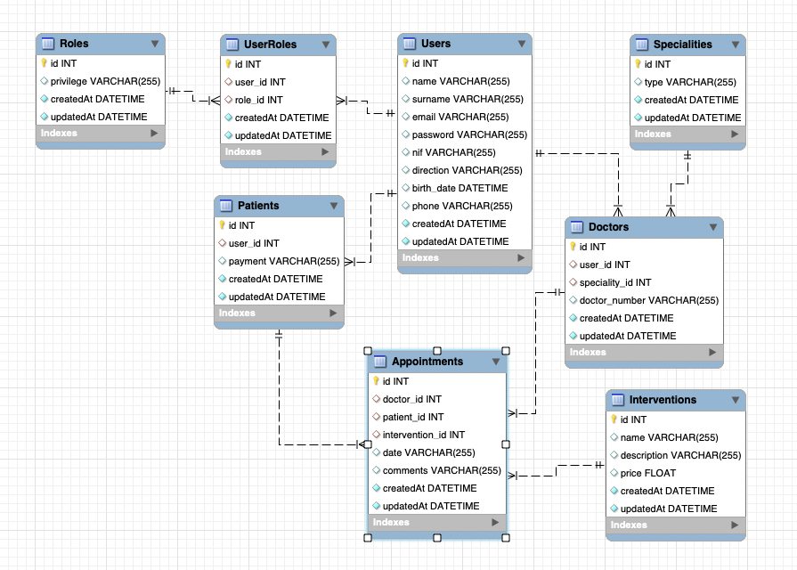

# PROYECTO 4 FSD BACKEND CLÍNICA DENTAL

<details>
  <summary>Contenido 📝</summary>
  <ol>
    <li><a href="#objetivo">Objetivo</a></li>
    <li><a href="#sobre-el-proyecto">Sobre el proyecto</a></li>
    <!-- <li><a href="#deploy-🚀">Deploy</a></li> -->
    <li><a href="#stack">Stack</a></li>
    <li><a href="#diagrama-bd">Diagrama</a></li>
    <li><a href="#instalación-en-local">Instalación</a></li>
    <li><a href="#endpoints">Endpoints</a></li>
    <li><a href="#futuras-funcionalidades">Futuras funcionalidades</a></li>
    <li><a href="#contribuciones">Contribuciones</a></li>
    <li><a href="#licencia">Licencia</a></li>
    <li><a href="#webgrafia">Webgrafia</a></li>
    <li><a href="#desarrollo">Desarrollo</a></li>
    <li><a href="#agradecimientos">Agradecimientos</a></li>
    <li><a href="#contacto">Contacto</a></li>
  </ol>
</details>

## Objetivo

En este proyecto hemos desarrollado una API funcional conectada a una base de datos pensada para una clínica dental. Debía ser funcional para realizar consultas de citas, pacientes, doctores y gestionar los registros, acceso, área de clientes, y más.

## Sobre el proyecto
En nuestra API, los usuarios pueden registrarse a través de un formulario en el que se les pedirán datos personales. Con el registro, se les asigna un número de usuario y de paciente, así como un rol de usuario. El administrador podrá asignar roles a los usuarios, para que, en el caso de contratación de nuevos doctores, pueda identificarlos. Con el reparto de roles realizado, la API dispone de barreras y bifurcacioens para que, de forma orgánica, los usuarios puedan acceder a su perfil, crear citas y revisar datos de interés en función de los roles.

<!-- ## Deploy 🚀
<div align="center">
    <a href="https://www.google.com"><strong>Url a producción </strong></a>🚀🚀🚀
</div> -->

## Stack
Tecnologías utilizadas:
<div align="center">
<a href="https://www.expressjs.com/">
    
</a>
<a href="https://nodejs.org/es/">
    
</a>
<a href="https://developer.mozilla.org/es/docs/Web/JavaScript">
    
</a>
 </div>


## Diagrama BD


## Instalación en local
1. Clonar el repositorio
2. ` $ npm install `
3. Instalamos las dependencias

    `$ bcrypt`

    `$ dotenv`

    `$ express`

    `$ jsonwebtoken`

    `$ mysql2`

    `$ nodemon`

    `$ sequelize`

    `$ sequelize-cli`

4. Conectamos nuestro repositorio con la base de datos 
5. ``` $ Ejecutamos las migraciones ``` 
6. ``` $ Ejecutamos los seeders ``` 
6. ``` $ npm run dev ``` 

## Endpoints
<details>
<summary>Endpoints</summary>

- USER
    - REGISTER

            POST http://localhost:3000/users
        body:
        ``` js
            {
                "name": "Felipe",
                "surname": "Báguena Peña",
                "email": "felipe@felipe.com",
                "password": "123456",
                "nif": "22333444P",
                "direction": "Calle Falsa 123",
                "birth_date": "1987-08-21",
                "phone": "666444555"
            }
        ```

    - LOGIN

            POST http://localhost:3000/users/login
        body:
        ``` js
            {
                "email": "felipe@felipe.com",
                "password": "123456"
            }
        ```

    - BORRAR USUARIO POR ID

        `$ Requiere token (login) y rol de Admin`


            DELETE http://localhost:3000/users/:id

    - VER CITAS

        ` $ Requiere token (login). Dependiendo del rol, podremos ver las citas registradas como paciente o como doctor `


            GET http://localhost:3000/users/appointments

    - PERFIL DE USUARIO

        ` $ Requiere token (login)`


            GET http://localhost:3000/profile

    - ACTUALIZAR PERFIL DE USUARIO

        ` $ Requiere token (login)`


            PUT http://localhost:3000/updateprofile
        body:
        ``` js
            {
                "name": "Alyna",
                "surname": "Nastas Romaniuc",
                "email": "alyna@alyna.com",
                "password": "123456",
                "nif": "22555444E",
                "direction": "Calle Falsa 456",
                "birth_date": "1992-04-30",
                "phone": "666333444"
            }
        ```

    - ACTUALIZAR MÉTODO DE PAGO COMO CLIENTE

        ` $ Requiere token (login)`


            PUT http://localhost:3000/updateprofile/payment
        body:
        ``` js
            {
                "payment": "cash",
            }
        ```

    - CREAR NUEVOS ROLES

        `$ Requiere token (login) y rol de Admin`


            POST http://localhost:3000/roles
        body:
        ``` js
            {
                "privilege": "Doctor",
            }
        ```

    - CREAR NUEVAS CITAS

        `$ Requiere token (login)`

            POST http://localhost:3000/appoint
        body:
        ``` js
            {
                "doctor_id": 3,
                "intervention_id": 1,
                "date": "2023-03-07 11:00",
            }
        ```

    - MODIFICAR CITAS

        `$ Requiere token (login)`

            PUT http://localhost:3000/appoint
        body:
        ``` js
            {
                "id": 3,
                "date": "2023-03-09 13:00"
            }
        ```

    - CANCELAR CITAS

        `$ Requiere token (login)`

            DELETE http://localhost:3000/appoint/:id

    - VER CITAS PENDIENTES

        `$ Requiere token (login)`

            GET http://localhost:3000/appoint/coming

    - VER TODOS LOS USUARIOS REGISTRADOS

        `$ Requiere token (login) y rol de Admin`

            GET http://localhost:3000/admin/users

    - VER TODAS LAS CITAS DE LA CLÍNICA

        `$ Requiere token (login) y rol de Admin`

            GET http://localhost:3000/admin/appoint
    
    - VER TODOS LOS DOCTORES DE LA CLÍNICA

        `$ Requiere token (login) y rol de Admin`

            GET http://localhost:3000/admin/doctors

    - CREAR NUEVOS SERVICIOS

        `$ Requiere token (login) y rol de Admin`

            POST http://localhost:3000/appoint
        body:
        ``` js
            {
                "name": "extracción",
                "description": "cirujía menor",
                "price": 130
            }
        ```
    - DARSE DE ALTA COMO DOCTOR

        `$ Requiere token (login) y rol de Doctor`

            POST http://localhost:3000/doctors
        body:
        ``` js
            {
                "speciality_id": 1,
                "doctor_numer": "3443"
            }
        ```

    - ASIGNAR ROLES A UN USUARIO

        `$ Requiere token (login) y rol de Admin`

            POST http://localhost:3000/admin/roles
        body:
        ``` js
            {
                "user_id": 10,
                "rol_id": 2,
            }
        ```

    - VER ROLES DE UN USUARIO

        `$ Requiere token (login) y rol de Admin`

            GET http://localhost:3000/users/role/:id

</details>

## Futuras funcionalidades
[ ] Este proyecto está planteado para funcionar con un frontend desarrollado en React.
[ ] En el futuro, esperamos implementar los servicios para limpiar el código de los controladores.  
[ ] Un sistema de validación para las solicitudes de borrado de usuarios. 

## Contribuciones
Las sugerencias y aportaciones son siempre bienvenidas.  

Puedes hacerlo de dos maneras:

1. Abriendo una issue
2. Crea un fork del repositorio
    - Crea una nueva rama  
        ```
        $ git checkout -b feature/nombreUsuario-mejora
        ```
    - Haz un commit con tus cambios 
        ```
        $ git commit -m 'feat: mejora X cosa'
        ```
    - Haz push a la rama 
        ```
        $ git push origin feature/nombreUsuario-mejora
        ```
    - Abre una solicitud de Pull Request

## Licencia
Este proyecto se encuentra bajo licencia de Felipe Báguena Peña y Alyna Nastas Romaniuc.

## Webgrafia:
Para el desarrollo del proyecto se ha consultado en:
- <a href="https://sequelize.org/"><strong>Documentación de Sequelize</strong></a>
- <a href="https://jwt.io/"><strong>Sitio web de JSON Web Tokens</strong></a>
- <a href="https://pypi.org/project/bcrypt/"><strong>Documentación de Bcrypt</strong></a>

## Desarrollo:

Todo el proyecto ha sido desarrollado por Felipe Báguena Peña y Alyna Nastas Romaniuc.

## Agradecimientos:

Agradezco a mis compañeros el tiempo dedicado a este proyecto:

- **Jose**  
<a href="https://github.com/JoseMarin" target="_blank"></a> 

- **David**  
<a href="https://github.com/Dave86dev" target="_blank"></a>

- ***Mara***  
<a href="https://github.com/MaraScampini" target="_blank"></a> 

- ***Dani***  
<a href="https://github.com/datata" target="_blank"></a> 

## Contacto

- ***Felipe Báguena***  
<a href = "mailto:felipebaguena@gmail.com"></a>
<a href="https://github.com/felipebaguena" target="_blank"></a> 

- ***Alyna Nastas***  
<a href = "mailto:https://github.com/AlynaNastas"></a>
<a href="https://github.com/AlynaNastas" target="_blank"></a> 